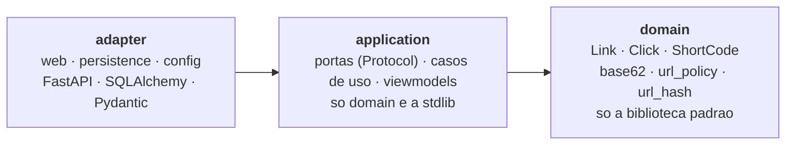

# url-shortener

API que recebe uma URL longa, devolve um código curto de sete caracteres e redireciona esse código
de volta ao destino, registrando cada acesso. O código é o id da sequence do PostgreSQL convertido
para **base 62**, então colisão é impossível por construção, e não apenas improvável; a
**deduplicação é fechada por uma constraint única**, e não por uma checagem em Python. Projeto de
estudo e portfólio, escrito para que cada decisão de desenho seja defensável, uma por uma.

[](https://github.com/wastecoder/python-url-shortener/actions/workflows/ci.yml)


---

## Sumário

- [Visão geral](#visão-geral)
- [Arquitetura](#arquitetura)
- [O fluxo](#o-fluxo)
- [Stack](#stack)
- [Como rodar](#como-rodar)
- [O fluxo na prática](#o-fluxo-na-prática)
- [Testes e qualidade](#testes-e-qualidade)
- [Documentação](#documentação)
- [Roadmap](#roadmap)

---

## Visão geral

Quatro rotas, e nada além delas:

| Método | Rota | Sucesso | O que faz |
|---|---|---|---|
| `POST` | `/links` | `201` ou `200` | Encurta a URL, ou devolve o link que ela já tinha |
| `GET` | `/{code}` | `302` | Redireciona para o destino e **registra o acesso** |
| `GET` | `/links/{code}` | `200` | Destino, data de criação e total de acessos |
| `GET` | `/health` | `200` / `503` | Diz se o serviço consegue falar com o banco |

**O projeto é pequeno de propósito, e isso é o ponto.** Ele não é julgado pelo tanto que faz; é
julgado pelo tanto que cada decisão consegue ser justificada. Quatro rotas com testes de integração
contra um banco de verdade, um CI que barra o merge e uma documentação que explica os trade-offs
valem mais aqui do que vinte rotas sem nada disso.

**O que ficou de fora ficou de fora de propósito**, e cada corte tem resposta pronta: as peças de
escala do desenho do Alex Xu no
[`CHALLENGE.md` §4](docs/CHALLENGE.md#4-a-origem-o-capítulo-8-do-alex-xu), e a funcionalidade e o
rigor cortados na [tabela do §5](docs/CHALLENGE.md#5-o-que-ficou-de-fora-e-por-quê) — com o roadmap
correspondente em [`docs/PROGRESS-V2.md`](docs/PROGRESS-V2.md).

Objetivos de aprendizado exercitados:

- **Arquitetura hexagonal de verdade** — dependências apontando para dentro, portas como
  `typing.Protocol`, e a regra **verificada por ferramenta** (`import-linter`, 4 contratos no CI) em
  vez de por convenção.
- **Concorrência num banco relacional** — a corrida entre `SELECT` e `INSERT`, fechada por
  `ON CONFLICT`, provada por oito requisições simultâneas de verdade.
- **Escrita no caminho de leitura** — por que `click` é append-only e por que não existe coluna de
  contador em `link`.
- **HTTP levado a sério** — `302` versus `301` versus `307`, `201` versus `200`, e RFC 7807 em
  **todo** erro, inclusive nos que o roteador produz.
- **Validação de destino como superfície de ataque** — `javascript:`, `file://`, faixas privadas,
  metadados de cloud, e as grafias numéricas de `127.0.0.1` que o navegador resolve.
- **Qualidade verificada** — Testcontainers contra um PostgreSQL real, `mypy --strict` sobre
  `src`, `tests` e `migrations`, e dois gates de cobertura em 100%.

## Arquitetura

Hexagonal (*ports & adapters*), layout horizontal. **A seta de dependência aponta sempre para
dentro**, e o `domain` importa **só a biblioteca padrão**:



Isso não é uma promessa no README — é um comando que fica vermelho:

```console
$ uv run lint-imports
Analyzed 91 files, 183 dependencies.

The dependency arrow points inward KEPT
The domain imports no framework KEPT
The application imports no framework KEPT
The application boundary carries no domain object KEPT

Contracts: 4 kept, 0 broken.
```

Estrutura de pacotes, os quatro contratos, o modelo de execução síncrono e o modelo de dados em
[`docs/ARCHITECTURE.md`](docs/ARCHITECTURE.md).

## O fluxo


Três coisas nesse desenho são o projeto inteiro:

**O `SELECT` não fecha a corrida — a constraint fecha.** Entre o `SELECT` que não achou nada e o
`INSERT`, outra requisição pode inserir. Só o índice único sobre `sha256(url)` fecha essa janela; o
`SELECT` inicial é otimização e o `SELECT` final é como o perdedor descobre com qual código
responder. **Trocar o `INSERT ... ON CONFLICT` por um check-then-insert em Python devolve exatamente
o bug que a constraint existe para matar** — e o projeto tem oito requisições simultâneas de verdade
provando isso.

**O redirect é `302`, nunca `301` e nunca `307`.** `301` é guardado em cache pelo navegador, e o
segundo clique nunca chega ao servidor: isso mata a medição e torna o destino impossível de trocar ou
desativar depois. `307` é o *default* do `RedirectResponse` do Starlette e preserva o método HTTP, que
não é o que um link curto significa. ([ADR-0001](docs/adr/0001-redirect-302.md))

**`click` só recebe `INSERT`, e o total é um `COUNT` na leitura.** Nunca existe um
`UPDATE link SET clicks = clicks + 1`: isso seria uma escrita no caminho de leitura, sobre a mesma
linha, e dois acessos simultâneos a um link viral disputariam aquele lock. O `INSERT` não disputa com
nada. A troca é contenção no caminho quente por trabalho no caminho frio, e é a troca correta aqui.

Os dois fluxos em diagrama de sequência, passo a passo, estão em
[`docs/ARCHITECTURE.md`](docs/ARCHITECTURE.md#5-fluxo-de-criação-post-links).

## Stack

| Camada | Tecnologia |
|---|---|
| Linguagem / build | **Python 3.13**, **uv** (interpretador, venv e lock), layout `src/`, hatchling |
| Framework | **FastAPI 0.141.1** + **Pydantic v2** — todo endpoint é `def`, nunca `async def` |
| Persistência | **SQLAlchemy 2.0** em modo síncrono sobre **psycopg 3**, **Alembic**, **PostgreSQL 18.6** |
| Testes | **pytest**, **Testcontainers**, `fastapi.testclient` — 505 testes, dois gates de cobertura em 100% |
| Qualidade | **Ruff** (lint e formatação, inclusive dos blocos de código do Markdown), **mypy `--strict`**, **import-linter** |
| Empacotamento | **Docker** multi-stage, usuário não-root, **Compose** com três serviços |
| CI | **GitHub Actions**, três jobs independentes, barrando o merge |

## Como rodar

Precisa de Docker, e de mais nada — nem Python instalado, nem `.env`, nem migration na mão.

```bash
docker compose up
```

Sobem três serviços, **nesta ordem**:

1. **`postgres`** — o banco, num volume próprio.
2. **`migrate`** — aplica as migrations do Alembic e sai.
3. **`api`** — o servidor, na porta 8000.

A `api` só é iniciada depois de a `migrate` ter saído com **código 0**, então uma migration que falha
impede o servidor de subir em vez de deixá-lo responder `500` sobre um schema que não existe
([ADR-0009](docs/adr/0009-migracao-e-passo-de-deploy.md)).

A documentação interativa fica em <http://localhost:8000/docs>, e **é a interface deste projeto**:
não há front-end porque não é preciso um.

Para derrubar tudo, incluindo o volume do banco: `docker compose down -v`. Para desenvolver sem
Docker, comandos do `uv` e configuração: [`docs/DEVELOPMENT.md`](docs/DEVELOPMENT.md).

## O fluxo na prática

Quatro chamadas percorrem o projeto inteiro, e cada uma existe para provar uma decisão diferente.

**1. Encurtar** — responde `201 Created`, e o `Location` aponta para `/links/{code}`, o recurso que
acabou de ser criado. Não para a URL curta, que já vem no corpo.

```bash
curl -i -X POST localhost:8000/links -H 'content-type: application/json' \
     -d '{"url": "https://docs.python.org/3/library/dataclasses.html"}'
```

**2. A mesma URL de novo** — responde `200 OK` com **o mesmo código**, e `link` continua com **uma
linha**. O status é a única diferença entre os dois desfechos: `201` é "criei agora", `200` é "já
existia", e quem chama distingue sem que o corpo precise carregar um campo dizendo qual foi.

```bash
curl -sS -o /dev/null -w '%{http_code}\n' -X POST localhost:8000/links \
     -H 'content-type: application/json' \
     -d '{"url": "https://docs.python.org/3/library/dataclasses.html"}'
```

**3. Seguir o código** — responde `302`, e grava o acesso **antes** de montar a resposta. O `code`
são os sete caracteres e nada mais; a URL curta inteira não casa com a rota.

```bash
curl -i localhost:8000/0000001
```

```http
HTTP/1.1 302 Found
location: https://docs.python.org/3/library/dataclasses.html
cache-control: no-store
```

**4. Ler o que ficou registrado** — o `total_clicks` é um `COUNT` sobre `click` no momento da
leitura, e não uma coluna de contador em `link`. É por isso que ele já conta o passo 3.

```bash
curl -sS localhost:8000/links/0000001
```

```json
{
  "code": "0000001",
  "short_url": "http://localhost:8000/0000001",
  "url": "https://docs.python.org/3/library/dataclasses.html",
  "created_at": "2026-03-14T15:09:26Z",
  "total_clicks": 1
}
```

Um destino que a política recusa sai no envelope RFC 7807 — como **todo** erro desta API, inclusive
os que o roteador produz antes de qualquer controlador rodar. Corpos, a taxonomia completa de erros
e o *walkthrough* em [`docs/API.md`](docs/API.md).

## Testes e qualidade

```bash
uv run pytest              # 484 testes, sem Docker, em segundos
uv run pytest -m integration   # 21 testes contra um PostgreSQL de verdade
uv run pytest -m ""        # os 505
```

**Os testes de integração sobem um PostgreSQL real com Testcontainers**, migrado com as mesmas
migrations que a produção roda, e verificam **estado do banco** — não valor de retorno. É a diferença
que faz os três testes que sustentam o projeto valerem alguma coisa: com um repositório mockado, "a
mesma URL duas vezes devolve o mesmo código" prova apenas que o mock foi programado assim.

Os que carregam o projeto:

| Teste | O que ele prova |
|---|---|
| Encurtar e seguir | O fluxo ponta a ponta: `302` e o `Location` certo |
| Deduplicação | O mesmo código volta **e existe exatamente uma linha** em `link` |
| O clique foi registrado | O redirect deixou uma linha nova em `click` |
| **Oito requisições simultâneas** | Um `201`, sete `200`, um código, **uma linha** — impossível de escrever com mock, porque o que está sob teste é o comportamento do banco sob concorrência |
| O `COMMIT` que falha | Uma constraint adiada faz o segundo redirect responder **`500`, e não `302`** — a fronteira da transação como fato observável |
| `/health` com o pool esgotado | As quinze conexões são retiradas à mão e o endpoint responde `200` na hora |

O CI roda três jobs independentes, sem `needs:` entre eles:

| Job | O que faz |
|---|---|
| `check` | `ruff check`, `ruff format --check`, `mypy`, `lint-imports`, os testes unitários e o gate de cobertura de `domain` + `application` |
| `integration` | As duas suítes contra um PostgreSQL de verdade, e o gate de cobertura da árvore inteira |
| `image` | Constrói a imagem, sobe a stack com `--wait` e exercita o fluxo pela porta publicada |

**A `main` é protegida e exige `check` e `integration`**, então um pull request vermelho em qualquer
um dos dois não é mergeável. O `image` roda em todo pull request mas **não** é contexto obrigatório —
um PR vermelho só nele ainda mergeia, e fechar essa folga é uma linha nas configurações de proteção
da branch. Estratégia completa em [`docs/TESTS.md`](docs/TESTS.md).

## Documentação

| Documento | Conteúdo |
|---|---|
| [`docs/README.md`](docs/README.md) | Índice da documentação e por onde começar |
| [`docs/CHALLENGE.md`](docs/CHALLENGE.md) | O *brief* do desafio: contexto, requisitos, critérios de aceite, o mapeamento do capítulo do Xu e a tabela do **que ficou de fora** |
| [`docs/ARCHITECTURE.md`](docs/ARCHITECTURE.md) | Hexágono, pacotes, contratos de dependência, modelo síncrono, os dois fluxos e o modelo de dados |
| [`docs/API.md`](docs/API.md) | As quatro rotas, corpos, a taxonomia de erros RFC 7807 e o *walkthrough* |
| [`docs/DEVELOPMENT.md`](docs/DEVELOPMENT.md) | Como rodar com e sem Docker, comandos, migrations, o pipeline e onde achar cada coisa |
| [`docs/TESTS.md`](docs/TESTS.md) | Estratégia, Testcontainers, Object Mother e os dois gates de cobertura |
| [`docs/SECURITY.md`](docs/SECURITY.md) | O que a política de destino recusa, as defesas da imagem, e o que **não** está defendido |
| [`docs/adr/`](docs/adr/) | Nove ADRs: o porquê de cada decisão estrutural — [a tabela com os temas](docs/README.md#adrs) |
| [`docs/PROGRESS-V1.md`](docs/PROGRESS-V1.md) · [`docs/PROGRESS-V2.md`](docs/PROGRESS-V2.md) | O roadmap fase a fase, e o que ficou de fora |

## Roadmap

O escopo mínimo foi construído em fases, da **Fase 0** (fundação, uv, CI, contratos de arquitetura) à
**Fase 7** (documentação), passando por domínio puro, portas e casos de uso, adaptador web,
persistência em PostgreSQL, Testcontainers e Docker — **todas concluídas**, com o registro do que foi
de fato construído em cada uma, e as evidências, em
[`docs/PROGRESS-V1.md`](docs/PROGRESS-V1.md).

A evolução depois do V1 está em [`docs/PROGRESS-V2.md`](docs/PROGRESS-V2.md), da Fase 8 à 12. **Se o
projeto continuar, o começo é a Fase 8:** a permutação multiplicativa é a melhor resposta técnica que
o projeto ainda não tem, e custa quinze linhas.
