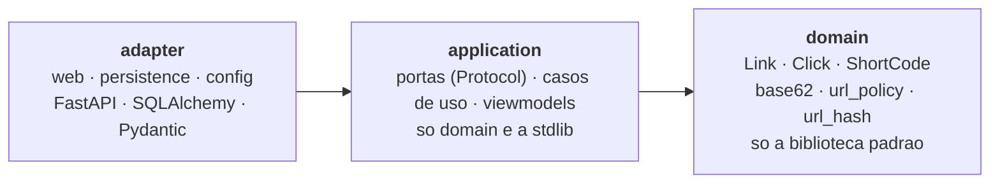
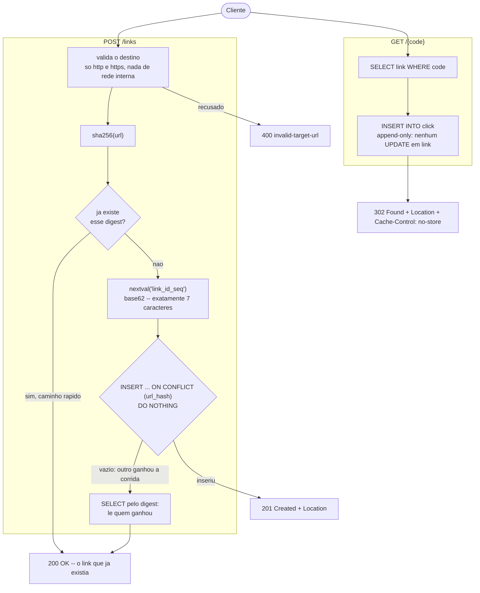

# url-shortener

API que recebe uma URL longa, devolve um código curto de sete caracteres e redireciona esse código
de volta ao destino, registrando cada acesso. O código é o id da sequence do PostgreSQL convertido
para **base 62**, então colisão é impossível por construção, e não apenas improvável; a
**deduplicação é fechada por uma constraint única**, e não por uma checagem em Python. Projeto de
estudo e portfólio, escrito para que cada decisão de desenho seja defensável, uma por uma.

[](https://github.com/wastecoder/python-url-shortener/actions/workflows/ci.yml)


---

## Sumário

- [Visão geral](#visão-geral)
- [Arquitetura](#arquitetura)
- [O fluxo](#o-fluxo)
- [Stack](#stack)
- [Como rodar](#como-rodar)
- [O fluxo na prática](#o-fluxo-na-prática)
- [Testes e qualidade](#testes-e-qualidade)
- [Decisões em destaque](#decisões-em-destaque)
- [O que ficou de fora](#o-que-ficou-de-fora)
- [Documentação](#documentação)
- [Roadmap](#roadmap)

---

## Visão geral

Quatro rotas, e nada além delas:

| Método | Rota | Sucesso | O que faz |
|---|---|---|---|
| `POST` | `/links` | `201` ou `200` | Encurta a URL, ou devolve o link que ela já tinha |
| `GET` | `/{code}` | `302` | Redireciona para o destino e **registra o acesso** |
| `GET` | `/links/{code}` | `200` | Destino, data de criação e total de acessos |
| `GET` | `/health` | `200` / `503` | Diz se o serviço consegue falar com o banco |

**O projeto é pequeno de propósito, e isso é o ponto.** Ele não é julgado pelo tanto que faz; é
julgado pelo tanto que cada decisão consegue ser justificada. Quatro rotas com testes de integração
contra um banco de verdade, um CI que barra o merge e uma documentação que explica os trade-offs
valem mais aqui do que vinte rotas sem nada disso.

Objetivos de aprendizado exercitados:

- **Arquitetura hexagonal de verdade** — dependências apontando para dentro, portas como
  `typing.Protocol`, e a regra **verificada por ferramenta** (`import-linter`, 4 contratos no CI) em
  vez de por convenção.
- **Concorrência num banco relacional** — a corrida entre `SELECT` e `INSERT`, fechada por
  `ON CONFLICT`, provada por oito requisições simultâneas de verdade.
- **Escrita no caminho de leitura** — por que `click` é append-only e por que não existe coluna de
  contador em `link`.
- **HTTP levado a sério** — `302` versus `301` versus `307`, `201` versus `200`, e RFC 7807 em
  **todo** erro, inclusive nos que o roteador produz.
- **Validação de destino como superfície de ataque** — `javascript:`, `file://`, faixas privadas,
  metadados de cloud, e as grafias numéricas de `127.0.0.1` que o navegador resolve.
- **Qualidade verificada** — Testcontainers contra um PostgreSQL real, `mypy --strict` sobre
  `src`, `tests` e `migrations`, e dois gates de cobertura em 100%.

## Arquitetura

Hexagonal (*ports & adapters*), layout horizontal. **A seta de dependência aponta sempre para
dentro**, e o `domain` importa **só a biblioteca padrão**:



Isso não é uma promessa no README — é um comando que fica vermelho:

```console
$ uv run lint-imports
Analyzed 91 files, 183 dependencies.

The dependency arrow points inward KEPT
The domain imports no framework KEPT
The application imports no framework KEPT
The application boundary carries no domain object KEPT

Contracts: 4 kept, 0 broken.
```

Estrutura de pacotes, os quatro contratos, o modelo de execução síncrono e o modelo de dados em
[`docs/ARCHITECTURE.md`](docs/ARCHITECTURE.md).

## O fluxo



Três coisas nesse desenho são o projeto inteiro:

**O `SELECT` não fecha a corrida — a constraint fecha.** Entre o `SELECT` que não achou nada e o
`INSERT`, outra requisição pode inserir. Só o índice único sobre `sha256(url)` fecha essa janela; o
`SELECT` inicial é otimização e o `SELECT` final é como o perdedor descobre com qual código
responder. **Trocar o `INSERT ... ON CONFLICT` por um check-then-insert em Python devolve exatamente
o bug que a constraint existe para matar** — e o projeto tem oito requisições simultâneas de verdade
provando isso.

**O redirect é `302`, nunca `301` e nunca `307`.** `301` é guardado em cache pelo navegador, e o
segundo clique nunca chega ao servidor: isso mata a medição e torna o destino impossível de trocar ou
desativar depois. `307` é o *default* do `RedirectResponse` do Starlette e preserva o método HTTP, que
não é o que um link curto significa. ([ADR-0001](docs/adr/0001-redirect-302.md))

**`click` só recebe `INSERT`, e o total é um `COUNT` na leitura.** Nunca existe um
`UPDATE link SET clicks = clicks + 1`: isso seria uma escrita no caminho de leitura, sobre a mesma
linha, e dois acessos simultâneos a um link viral disputariam aquele lock. O `INSERT` não disputa com
nada. A troca é contenção no caminho quente por trabalho no caminho frio, e é a troca correta aqui.

Os dois fluxos em diagrama de sequência, passo a passo, estão em
[`docs/ARCHITECTURE.md`](docs/ARCHITECTURE.md#5-fluxo-de-criação-post-links).

## Stack

| Camada | Tecnologia |
|---|---|
| Linguagem / build | **Python 3.13**, **uv** (interpretador, venv e lock), layout `src/`, hatchling |
| Framework | **FastAPI 0.141.1** + **Pydantic v2** — todo endpoint é `def`, nunca `async def` |
| Persistência | **SQLAlchemy 2.0** em modo síncrono sobre **psycopg 3**, **Alembic**, **PostgreSQL 18.6** |
| Testes | **pytest**, **Testcontainers**, `fastapi.testclient` — 505 testes, dois gates de cobertura em 100% |
| Qualidade | **Ruff** (lint e formatação, inclusive dos blocos de código do Markdown), **mypy `--strict`**, **import-linter** |
| Empacotamento | **Docker** multi-stage, usuário não-root, **Compose** com três serviços |
| CI | **GitHub Actions**, três jobs independentes, barrando o merge |

## Como rodar

Precisa de Docker, e de mais nada — nem Python instalado, nem `.env`, nem migration na mão.

```bash
docker compose up
```

Sobem três coisas, **nesta ordem**: o PostgreSQL, um serviço que aplica as migrations e sai, e a API
na porta 8000. A API só é iniciada depois de a migration ter saído com **código 0**, então uma
migration que falha impede o servidor de subir em vez de deixá-lo responder `500` sobre um schema que
não existe ([ADR-0009](docs/adr/0009-migracao-e-passo-de-deploy.md)).

A documentação interativa fica em <http://localhost:8000/docs>, e **é a interface deste projeto**:
não há front-end porque não é preciso um.

Para derrubar tudo, incluindo o volume do banco: `docker compose down -v`. Para desenvolver sem
Docker, comandos do `uv` e configuração: [`docs/DEVELOPMENT.md`](docs/DEVELOPMENT.md).

## O fluxo na prática

```bash
# cria o link -- 201 Created, e o Location aponta para os metadados
curl -sS -X POST localhost:8000/links -H 'content-type: application/json' \
     -d '{"url": "https://docs.python.org/3/library/dataclasses.html"}'

# a mesma URL de novo -- 200 OK, o mesmo codigo, e uma unica linha no banco
curl -sS -o /dev/null -w '%{http_code}\n' -X POST localhost:8000/links \
     -H 'content-type: application/json' \
     -d '{"url": "https://docs.python.org/3/library/dataclasses.html"}'

# segue o codigo -- 302 Found, e o acesso fica registrado
curl -i localhost:8000/0000001

# o que ficou registrado, inclusive o total de acessos
curl -sS localhost:8000/links/0000001
```

```json
{
  "code": "0000001",
  "short_url": "http://localhost:8000/0000001",
  "url": "https://docs.python.org/3/library/dataclasses.html",
  "created_at": "2026-03-14T15:09:26Z",
  "total_clicks": 1
}
```

Um destino que a política recusa sai no envelope RFC 7807, como **todo** erro desta API:

```json
{
  "type": "invalid-target-url",
  "title": "The target URL was refused",
  "status": 400,
  "detail": "169.254.169.254 is not a publicly routable address",
  "instance": "/links",
  "reason": "non-public-address"
}
```

Corpos de requisição e resposta, a taxonomia completa de erros e o *walkthrough* em
[`docs/API.md`](docs/API.md).

## Testes e qualidade

```bash
uv run pytest              # 484 testes, sem Docker, em segundos
uv run pytest -m integration   # 21 testes contra um PostgreSQL de verdade
uv run pytest -m ""        # os 505
```

**Os testes de integração sobem um PostgreSQL real com Testcontainers**, migrado com as mesmas
migrations que a produção roda, e verificam **estado do banco** — não valor de retorno. É a diferença
que faz os três testes que sustentam o projeto valerem alguma coisa: com um repositório mockado, "a
mesma URL duas vezes devolve o mesmo código" prova apenas que o mock foi programado assim.

Os que carregam o projeto:

| Teste | O que ele prova |
|---|---|
| Encurtar e seguir | O fluxo ponta a ponta: `302` e o `Location` certo |
| Deduplicação | O mesmo código volta **e existe exatamente uma linha** em `link` |
| O clique foi registrado | O redirect deixou uma linha nova em `click` |
| **Oito requisições simultâneas** | Um `201`, sete `200`, um código, **uma linha** — impossível de escrever com mock, porque o que está sob teste é o comportamento do banco sob concorrência |
| O `COMMIT` que falha | Uma constraint adiada faz o segundo redirect responder **`500`, e não `302`** — a fronteira da transação como fato observável |
| `/health` com o pool esgotado | As quinze conexões são retiradas à mão e o endpoint responde `200` na hora |

O CI roda três jobs independentes — `check`, `integration` e `image` — e o terceiro constrói a
imagem, sobe a stack inteira e exercita o fluxo pela porta publicada. **A `main` é protegida e exige
`check` e `integration`**, então um pull request vermelho em qualquer um dos dois não é mergeável; o
`image` roda em todo pull request mas não é contexto obrigatório. Estratégia completa em
[`docs/TESTS.md`](docs/TESTS.md).

## Decisões em destaque

| ADR | Tema |
|---|---|
| [0001](docs/adr/0001-redirect-302.md) | O redirect é `302`, não `301` |
| [0002](docs/adr/0002-base62-sobre-a-sequence.md) | Código gerado por base 62 sobre a sequence, não por hash da URL |
| [0003](docs/adr/0003-sem-fila.md) | Sem fila, e o lugar exato onde ela entraria |
| [0004](docs/adr/0004-fronteira-sem-objeto-de-dominio.md) | A fronteira da aplicação não carrega objeto de domínio |
| [0005](docs/adr/0005-corpo-de-requisicao-sem-httpurl.md) | O corpo do `POST /links` carrega uma string, não um `HttpUrl` |
| [0006](docs/adr/0006-envelope-de-erro-problem-details.md) | Todo erro da API sai no mesmo envelope Problem Details |
| [0007](docs/adr/0007-fronteira-da-transacao.md) | A transação commita antes de a resposta ser enviada |
| [0008](docs/adr/0008-health-responde-503-no-mesmo-envelope.md) | O `/health` responde `503` no mesmo envelope, e é o único `503` da API |
| [0009](docs/adr/0009-migracao-e-passo-de-deploy.md) | A migração é um passo do deploy, não do startup da aplicação |

## O que ficou de fora

Esta é a parte do repositório que mais vale ser lida. **Cada linha abaixo foi cortada de propósito**,
e é isso que separa "projeto pequeno" de "escopo decidido". O roadmap correspondente está em
[`docs/PROGRESS-V2.md`](docs/PROGRESS-V2.md), e as duas coisas andam juntas: puxar um item para o
código sem tirar a linha daqui deixa este README mentindo.

### As peças de escala do desenho do Alex Xu

O algoritmo do código curto segue o capítulo 8 de *System Design Interview* — alfabeto de 62,
comprimento 7, id sequencial em base 62. O que saiu só existe lá por causa de escala que este projeto
não tem.

| Peça | O que ela resolve lá | Por que sai daqui |
|---|---|---|
| **Gerador de id distribuído** (Snowflake) | Vários nós escrevendo precisam de ids únicos sem coordenar | Há **um** PostgreSQL escrevendo. A `BIGSERIAL` já **é** o gerador, é transacional e é de graça |
| **Cache Redis** na leitura | Absorver o redirect, que é o caminho quente | Sem número de tráfego, um cache é uma segunda fonte de verdade e um problema de invalidação comprados de graça. O repositório está atrás de uma porta: quando o número existir, o cache entra como implementação nova e **nenhuma outra camada muda** |
| **Bloom filter** | "Esse código já existe?", sem ir ao banco | A pergunta não existe aqui: o código não é escolhido, é derivado de um id que o banco acabou de emitir |
| **Sharding** | Volume que não cabe numa instância | Problema de volume que este projeto não tem, e cuja solução torna toda consulta mais cara |

### Funcionalidade

| Corte | Por quê | Onde entra |
|---|---|---|
| **Interface web** | O `/docs` gerado já é uma UI completa e honesta. Um front-end acrescentaria superfície sem acrescentar argumento | — |
| **Fila / broker** | O clique é o único candidato, e só numa escala que este projeto não tem. O critério é "perder um clique é aceitável, atrasar um redirect não" — e não "é assíncrono, então põe fila". A criação é síncrona de propósito: quem chama precisa do código de volta na mesma requisição | [ADR-0003](docs/adr/0003-sem-fila.md), Fase 10 |
| **Expiração de link** | Uma coluna e uma checagem — mas um link vencido tem que responder **`410 Gone`** e não `404`, porque `404` é "nunca existiu" e `410` é "existiu e acabou". Metade disso seria pior que nada | Fase 9 |
| **Alias customizado** | A partir dele a `UNIQUE` em `code` **deixa de ser rede e vira mecanismo**, e a lista de códigos reservados deixa de ser defesa em profundidade e passa a ser a única defesa | Fase 9 |
| **Estatísticas / agregação** | A tabela `click` já guarda o dado bruto, então isto é uma consulta e não uma mudança de modelo — que foi exatamente o motivo de não existir contador dentro de `link` | Fase 9 |
| **Autenticação e dono do link** | Sem dono, qualquer um encurta. Num serviço real é obrigatório; aqui acrescentaria uma tabela, um header e autorização por recurso sem tocar em nenhuma das decisões que o projeto existe para demonstrar | Fase 8 |
| **Limite de taxa** | É o primeiro item da lista de próximos passos do próprio capítulo do Xu, e existe pelo mesmo motivo: sem limite, alguém cria milhões de links de graça | Fase 8 |
| **Qualquer LLM** | Uma URL é estruturada por definição. Um modelo acrescentaria latência, custo e um modo de falha sem resolver nada | — |

### Rigor e operação

| Corte | Por quê | Onde entra |
|---|---|---|
| **Códigos não enumeráveis** | `0000001`, `0000002`, `0000003` são links consecutivos, e alguém pode varrer o espaço usado. É o custo aceito por nunca colidir por construção. A correção é uma permutação multiplicativa sobre o id antes de codificar, e custa quinze linhas — é o melhor item técnico que o projeto ainda não tem | [ADR-0002](docs/adr/0002-base62-sobre-a-sequence.md), Fase 8 |
| **Resolução de nome na validação** | A política decide só pela string, então `evil.com` apontando para `127.0.0.1` passa. Resolver sairia do domínio puro (resolução é I/O) e **ainda assim não fecharia** o *DNS rebinding*, porque o endereço pode mudar entre a checagem e o clique | [`SECURITY.md`](docs/SECURITY.md#7-o-que-não-está-defendido), Fase 8 |
| **Observabilidade** (métricas, tracing, log estruturado) | Não existe stack de observabilidade aqui, e documentar uma seria o único documento aspiracional de um repositório cuja ética é não afirmar o que não é verdade. O que existe é um `/health` que **checa a dependência dele** | Fase 11 |
| **Teste de mutação** | É o instrumento certo para a pergunta que a cobertura de linha não responde — se o teste que sustenta o `302` testa alguma coisa. O critério de aceite já está escrito: *o mutante que troca `302` por `301` morre* | Fase 11 |
| **Teste de carga e deploy público** | Números de latência e vazão sem carga real são decoração; e uma URL pública é a única coisa desta lista que não muda nenhuma decisão de desenho | Fase 11 |

## Documentação

| Documento | Conteúdo |
|---|---|
| [`docs/README.md`](docs/README.md) | Índice da documentação e por onde começar |
| [`docs/CHALLENGE.md`](docs/CHALLENGE.md) | O *brief* do desafio: contexto, requisitos, critérios de aceite e o mapeamento do capítulo do Xu |
| [`docs/ARCHITECTURE.md`](docs/ARCHITECTURE.md) | Hexágono, pacotes, contratos de dependência, modelo síncrono, os dois fluxos e o modelo de dados |
| [`docs/API.md`](docs/API.md) | As quatro rotas, corpos, a taxonomia de erros RFC 7807 e o *walkthrough* |
| [`docs/DEVELOPMENT.md`](docs/DEVELOPMENT.md) | Como rodar com e sem Docker, comandos, migrations, o pipeline e onde achar cada coisa |
| [`docs/TESTS.md`](docs/TESTS.md) | Estratégia, Testcontainers, Object Mother e os dois gates de cobertura |
| [`docs/SECURITY.md`](docs/SECURITY.md) | O que a política de destino recusa, as defesas da imagem, e o que **não** está defendido |
| [`docs/adr/`](docs/adr/) | Nove ADRs: o porquê de cada decisão estrutural |
| [`docs/PROGRESS-V1.md`](docs/PROGRESS-V1.md) · [`docs/PROGRESS-V2.md`](docs/PROGRESS-V2.md) | O roadmap fase a fase, e o que ficou de fora |

## Roadmap

O escopo mínimo foi construído em fases, da **Fase 0** (fundação, uv, CI, contratos de arquitetura) à
**Fase 7** (documentação), passando por domínio puro, portas e casos de uso, adaptador web,
persistência em PostgreSQL, Testcontainers e Docker — **todas concluídas**, com o registro do que foi
de fato construído em cada uma, e as evidências, em
[`docs/PROGRESS-V1.md`](docs/PROGRESS-V1.md).

A evolução depois do V1 está em [`docs/PROGRESS-V2.md`](docs/PROGRESS-V2.md), da Fase 8 à 12. **Se o
projeto continuar, o começo é a Fase 8:** a permutação multiplicativa é a melhor resposta técnica que
o projeto ainda não tem, e custa quinze linhas.
