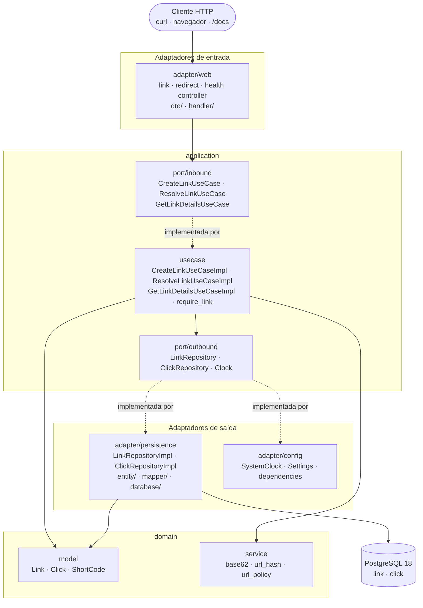
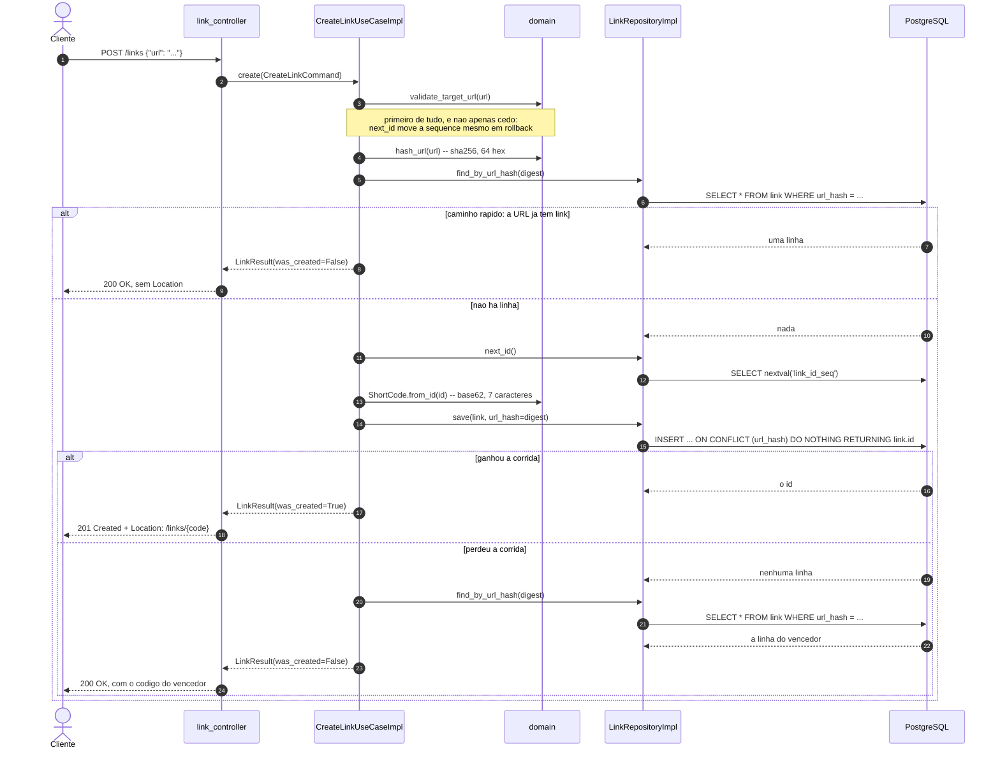
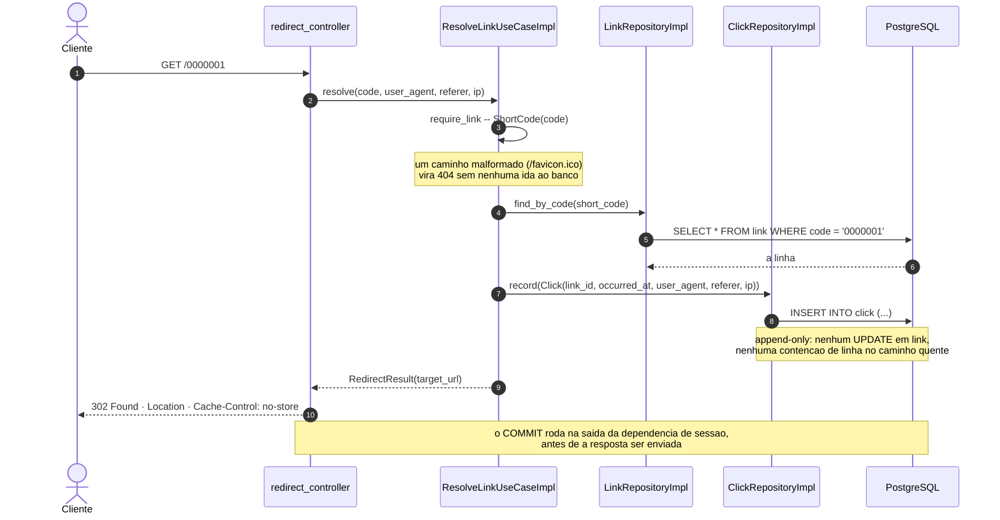
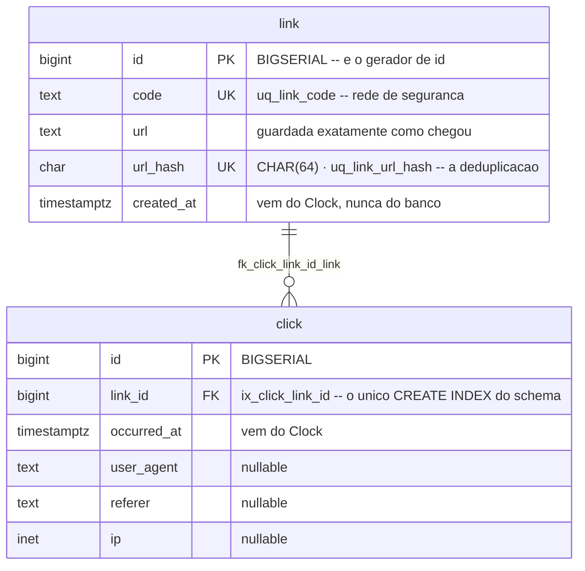

# Arquitetura

Como o código está organizado por dentro e por onde uma requisição passa: as camadas, a regra de
dependência e quem a verifica, o modelo de execução, os dois fluxos que sustentam o produto e o
modelo de dados.

> O **contrato HTTP** — rotas, corpos, status e erros — está em [`API.md`](API.md). O **porquê** de
> cada decisão estrutural está nos [ADRs](README.md#adrs). Como **rodar** está em
> [`DEVELOPMENT.md`](DEVELOPMENT.md).

- [1. Visão geral (hexagonal)](#1-visão-geral-hexagonal)
- [2. Estrutura de pacotes](#2-estrutura-de-pacotes)
- [3. Os quatro contratos de dependência](#3-os-quatro-contratos-de-dependência)
- [4. Modelo de execução: síncrono, de propósito](#4-modelo-de-execução-síncrono-de-propósito)
- [5. Fluxo de criação: POST /links](#5-fluxo-de-criação-post-links)
- [6. Fluxo de redirect: GET /{code}](#6-fluxo-de-redirect-get-code)
- [7. Modelo de dados](#7-modelo-de-dados)
- [8. A fronteira da transação](#8-a-fronteira-da-transação)
- [9. Composição e configuração](#9-composição-e-configuração)
- [10. Referências](#10-referências)

## 1. Visão geral (hexagonal)

Arquitetura hexagonal (*ports & adapters*) com layout horizontal. **A seta de dependência aponta
sempre para dentro:** `adapter -> application -> domain`.

- **`domain`** importa **só a biblioteca padrão**. Sem FastAPI, sem SQLAlchemy, sem Pydantic, sem
  Starlette. É testável com absolutamente nada de infraestrutura de pé.
- **`application`** importa `domain` mais `typing` e a stdlib. As portas são `typing.Protocol`.
- **`adapter`** pode importar tudo. É a única camada que sabe que existe um framework.



**As portas são `Protocol`, não classes abstratas.** Nenhum adaptador herda de uma porta — isso
manteria o adaptador importando `application` e apontaria a seta para fora. A conformidade é
**estrutural**, e quem a verifica é o `mypy`. É por isso que o `mypy` cobre `tests/` além de
`src/`: os *fakes* dos testes são declarações de conformidade, e uma declaração que nenhum
verificador lê não prova nada.

As portas também **não** são `@runtime_checkable`, de propósito: um `isinstance` contra um Protocol
runtime-checkable compara *nomes de método* e nada sobre assinaturas, então aceitaria alegremente um
`save` que devolve string.

**O sufixo `...Impl` é mantido.** É pouco pitônico e intencional: espelha o projeto Java de onde
este layout vem e deixa o par porta/adaptador óbvio de bater o olho.

## 2. Estrutura de pacotes

Pacote único, layout `src/`, gerenciado pelo **uv**.

```text
src/url_shortener/
├─ main.py                     composition root: lifespan, create_app, correcao do OpenAPI
├─ domain/                     so a stdlib
│  ├─ model/                   Link, Click, ShortCode          (dataclasses frozen)
│  ├─ service/                 base62, url_hash, url_policy    (funcoes puras)
│  └─ exception/               DomainError, InvalidTargetUrlError, LinkNotFoundError,
│                              ReservedCodeError, RejectionReason
├─ application/                domain + stdlib
│  ├─ port/inbound/            CreateLinkUseCase, ResolveLinkUseCase, GetLinkDetailsUseCase
│  ├─ port/outbound/           LinkRepository, ClickRepository, Clock
│  ├─ usecase/                 os tres ...Impl, mais link_lookup.require_link
│  └─ viewmodel/               CreateLinkCommand, LinkResult, LinkDetailsResult, RedirectResult
└─ adapter/                    pode importar tudo
   ├─ web/                     link_controller, redirect_controller, health_controller,
   │  │                        public_url, health_probe
   │  ├─ dto/request/          CreateLinkRequest
   │  ├─ dto/response/         LinkResponse, LinkDetailsResponse, HealthResponse, ProblemResponse
   │  └─ handler/              problem_details, problem_type, service_unavailable_error
   ├─ persistence/             LinkRepositoryImpl, ClickRepositoryImpl
   │  ├─ entity/               Base, LinkEntity, ClickEntity, LINK_ID_SEQUENCE
   │  ├─ mapper/               link_mapper (dois sentidos), click_mapper (so um)
   │  └─ database/             session (duas engines), probe (SELECT 1)
   └─ config/                  settings, dependencies, clock
```

**`inbound`/`outbound`, e não `in`/`out`.** `in` é palavra reservada — `application.port.in` seria
erro de sintaxe no import. É o único desvio intencional em relação aos nomes de pacote do projeto
Java.

### Sufixo, papel e onde mora

| Sufixo / nome | Papel | Localização |
|---|---|---|
| `*_controller.py` | Rota HTTP | `adapter/web/` |
| `*Request` / `*Response` | Corpo HTTP, Pydantic v2 | `adapter/web/dto/` |
| `*UseCase` (`Protocol`) | Porta de entrada | `application/port/inbound/` |
| `*UseCaseImpl` | Caso de uso | `application/usecase/` |
| `*Command` / `*Result` | Dado de fronteira, dataclass congelada | `application/viewmodel/` |
| `LinkRepository`, `ClickRepository`, `Clock` (`Protocol`) | Porta de saída | `application/port/outbound/` |
| `*RepositoryImpl` | Adaptador de saída | `adapter/persistence/` |
| `*Entity` | Tabela SQLAlchemy 2.0 | `adapter/persistence/entity/` |
| `*_mapper.py` | Conversão entidade ↔ domínio | `adapter/persistence/mapper/` |
| `*Error` | Exceção de domínio | `domain/exception/` |

Duas exceções que valem ser notadas, porque contradizem o padrão de propósito:

- **`HealthProbe` mora em `adapter/web/`, e não em `application/port/outbound/`.** `/health` não é
  caso de uso: ele não fala sobre o negócio, fala sobre o processo.
  [ADR-0008](adr/0008-health-responde-503-no-mesmo-envelope.md).
- **`ServiceUnavailableError` mora em `adapter/web/handler/`, e não em `domain/exception/`**, e não
  estende `DomainError`. "O banco está fora" não é regra de negócio, e nada no domínio poderia
  levantá-la.

Nenhuma porta de entrada declara um `execute` uniforme; os verbos são `create`, `resolve` e
`get_details`. A razão é estrutural: um `Protocol` não tem identidade nominal, então **o nome do
método é a identidade do tipo**. Três portas declarando `execute` são três formas que uma classe só
pode satisfazer por acidente — e o arquivo de wiring entregando a implementação errada ao
controlador certo passaria no type check.

## 3. Os quatro contratos de dependência

A regra de dependência é verificada por **import-linter** (`.importlinter`) e roda no CI. Não é
convenção: é um comando que fica vermelho.

| Contrato | O que ele proíbe |
|---|---|
| `The dependency arrow points inward` | `adapter` -> `application` -> `domain`, e nada na direção contrária |
| `The domain imports no framework` | `domain` importando `fastapi`, `starlette`, `sqlalchemy`, `pydantic` ou `alembic` |
| `The application imports no framework` | O mesmo para `application` |
| `The application boundary carries no domain object` | `application.viewmodel` e `application.port.inbound` importando `url_shortener.domain` |

```console
$ uv run lint-imports
Analyzed 91 files, 183 dependencies.
Contracts: 4 kept, 0 broken.
```

**O quarto contrato é o interessante**, e o contrato de camadas não conseguiria dizer o que ele diz.
A superfície que um controlador lê não carrega nenhum objeto de domínio — é isso que o pacote
`viewmodel` existe para afirmar. O contrato de camadas não pode expressá-lo, porque
`adapter -> domain` **precisa** continuar legal: o mapper da persistência converte linha em `Link`.
[ADR-0004](adr/0004-fronteira-sem-objeto-de-dominio.md).

É esse contrato que explica um detalhe que parece capricho: `LinkResult` é construído por uma função
módulo-privada `_as_result` dentro do caso de uso, e **não** por um `LinkResult.from_link`. Um
classmethod assim faria o viewmodel importar exatamente aquilo que ele existe para barrar.

**`main.py` fica fora do contrato de camadas de propósito** — o `.importlinter` nomeia `adapter`,
`application` e `domain`, e mais nada. Um *composition root* é o único lugar autorizado a conhecer
todas as camadas ao mesmo tempo.

Se um contrato quebrar, **conserte o import — não relaxe o contrato.** Mudar o `.importlinter` exige
um ADR.

## 4. Modelo de execução: síncrono, de propósito

**Todo endpoint é `def`, nunca `async def`.** As portas são síncronas, os casos de uso são
síncronos, o SQLAlchemy roda em modo síncrono sobre `psycopg`, e os testes usam
`fastapi.testclient.TestClient`. Não existe `pytest-asyncio` neste projeto.

O FastAPI roda endpoint `def` numa threadpool, que é a forma certa nesta escala — o gargalo é uma
ida ao PostgreSQL, não concorrência dentro do processo. A falha que a regra evita é a clássica: **um
driver síncrono chamado de dentro de `async def` trava o event loop**, o que é mensuravelmente pior
do que continuar síncrono.

Existe **exatamente um `async def` no repositório**, e ele não é endpoint: o lifespan ASGI em
`main.py`. Não é uma rachadura no modelo — o ASGI define esse hook como um gerenciador de contexto
assíncrono, nada está sendo servido enquanto ele roda, e nenhuma chamada de driver acontece dentro
de uma requisição por causa disso.

Async não está proibido para sempre, mas é **tudo ou nada**: tornar um controlador `async def`
significa tornar o caso de uso, as duas portas de repositório e as duas implementações `async def`
também, porque **são as assinaturas das portas que carregam isso**. Qualquer coisa menos que isso é
o bug acima. Trocar é decisão de V2 e precisa de ADR.

## 5. Fluxo de criação: `POST /links`



**Por que os passos 5 e 20 existem os dois.** Entre o `SELECT` que não achou nada e o `INSERT`,
outra requisição pode inserir. **Só a constraint única fecha essa janela.** O `SELECT` inicial é
otimização — evita gastar um id e tentar escrever quando quase sempre já existe linha; o `SELECT`
final é correção — é como o perdedor descobre com qual código responder. Trocar o passo 15 por um
*check-then-insert* em Python devolve exatamente o bug que a constraint existe para matar.

Três detalhes que não são decoração:

- **A validação vem antes de tudo.** `next_id` move a sequence mesmo dentro de uma transação que dá
  rollback, então validar depois deixaria uma URL recusada queimar um código a que nada jamais
  responderá.
- **O id é lido da sequence *antes* do insert.** É isso que permite o código ser calculado no
  domínio puro e a linha ser escrita com `code NOT NULL` numa única instrução. Lacunas na sequence
  vindas de transações revertidas são esperadas e inofensivas.
- **O alvo do conflito é `url_hash`, e nunca `code`.** Código duplicado é impossível por construção
  — sequence monotônica através de uma codificação bijetiva — então uma colisão ali tem que
  continuar barulhenta. Alargar para `on_conflict_do_nothing()` sem alvo silenciaria isso.

O insert termina com `RETURNING link.id`, e isso não é estilo: para um `INSERT` sem `RETURNING` o
SQLAlchemy não memoiza a contagem de linhas e fecha o cursor por baixo, e o psycopg zera o `rowcount`
para `-1` ao fechar — o valor seria lido de um cursor morto e nunca seria o `0` que um conflito
suprimido deveria produzir.

A engine fixa **`READ COMMITTED`**, mesmo sendo o default do PostgreSQL, e isso foi **medido, não
raciocinado**: sob `REPEATABLE READ` o `INSERT ... ON CONFLICT DO NOTHING` perdedor não volta vazio,
ele levanta `SerializationFailure` — e a requisição que perdeu a corrida responderia `500` em vez do
link vencedor. Uma pré-condição que uma linha no `postgresql.conf` pode revogar não é pré-condição.

## 6. Fluxo de redirect: `GET /{code}`



**A busca vem antes da escrita**, então um código que não nomeia nada não escreve nada. E o
`ShortCode` é construído **antes** de qualquer ida ao repositório: um `/favicon.ico` chegando na rota
catch-all custa zero round trips.

**Registrar o clique não é *best effort*.** Não há `try/except` em volta do `record`, e isso é
decisão: sem fila e sem outbox, engolir o erro transformaria uma falha de banco no único caminho de
escrita desta rota numa linha de log sem nenhum alarme atrás.

**`click` é append-only.** Nunca existe um `UPDATE link SET clicks = clicks + 1`: isso seria uma
escrita no caminho de leitura, sobre a mesma linha, e dois acessos simultâneos a um link viral
disputariam o lock daquela linha. O `INSERT` não disputa com nada. A troca é contenção no caminho
quente por trabalho no caminho frio — um `COUNT` na leitura — e é a troca correta aqui.

**A rota é registrada por último**, depois de `/links` e `/health`. `GET /{code}` é um catch-all que
casa qualquer segmento único na raiz; movê-lo para cima faria os dois outros caminhos resolverem
como código curto e responderem `404`, porque nenhum dos dois tem sete caracteres. As rotas de
documentação (`/docs`, `/redoc`, `/openapi.json`) estão a salvo por **outro** motivo, e não por
este: o `FastAPI.__init__` as registra na primeira instrução de `create_app`, antes de qualquer
`include_router`.

Essa é a mesma questão vista de dois lados. Do outro lado está a lista de códigos reservados em
`domain.service.url_policy` — `docs`, `redoc`, `openapi.json`, `health`, `links`. **Nenhum deles tem
sete caracteres**, então colisão com um código gerado é estruturalmente impossível, e é por isso que
a lista é **rede de segurança e não mecanismo**. Ela não tem chamador nenhum em `src/` hoje, e isso
é deliberado: ela existe para o dia em que um código for *escolhido* em vez de gerado — alias
customizado, importação, bug no gerador.

## 7. Modelo de dados

Duas tabelas, nomes de coluna em inglês.



| Restrição / índice | Onde | Para quê |
|---|---|---|
| `pk_link`, `pk_click` | `link.id`, `click.id` | Chave primária, `BIGSERIAL` |
| `uq_link_url_hash` | `link.url_hash` | **A deduplicação.** É esta constraint que fecha a corrida |
| `uq_link_code` | `link.code` | Rede de segurança. Colisão é impossível por construção; o índice existe para uma violação daquele argumento ser barulhenta em vez de silenciosa |
| `fk_click_link_id_link` | `click.link_id -> link.id` | Integridade referencial |
| `ix_click_link_id` | `click.link_id` | O `COUNT` do `total_clicks` |

`ix_click_link_id` é o **único** `CREATE INDEX` do schema; a unicidade de `code` e `url_hash` vem de
`UniqueConstraint`, não de `create_index`.

Cinco decisões carregadas nessas duas tabelas:

1. **O índice único é sobre `sha256(url)`, e não sobre `url`.** Uma entrada de btree do PostgreSQL
   tem limite de tamanho (por volta de 2,7 KB) e uma URL não tem comprimento definido. O hash dá
   uma chave de tamanho fixo. `CHAR(64)` é a largura literal de um SHA-256 em hexadecimal, escrita
   como literal e não derivada de constante — uma migration descreve o schema num momento no tempo,
   e uma constante que ela importasse poderia ser editada depois.
2. **O SHA-256 aqui não é primitiva de segurança.** É uma chave de largura fixa, e a URL que ele
   resume está em claro na coluna ao lado.
3. **O digest é calculado no domínio, não no repositório.** O *índice* é persistência; a *regra* —
   duas requisições significam o mesmo link quando as strings de URL são idênticas, byte a byte — é
   regra de negócio. Calculá-lo no repositório faria o repositório dono de uma decisão sobre quando
   dois links são um.
4. **`click` nunca recebe `UPDATE` nem `DELETE`.** Não há coluna de contador em `link`.
5. **Os carimbos de tempo vêm da porta `Clock`, não de um default do banco.** O domínio é dono de
   `created_at` e `occurred_at`, o que os torna congeláveis em teste. Sempre `datetime.now(UTC)`,
   **nunca um datetime ingênuo**, e as colunas são `TIMESTAMPTZ`. Um datetime ingênuo cruzando para
   o banco é o bug clássico de data em Python, e ele é silencioso — só aparece quando duas máquinas
   discordam sobre que horas era "agora".

**A sequence `link_id_seq` não é declarada ao SQLAlchemy, apenas nomeada.** Anexá-la ao
`Base.metadata` faria o SQLAlchemy emitir um `CREATE SEQUENCE` separado e transformaria `link.id` num
`BIGINT NOT NULL` sem default nenhum. Solta, ela é só um nome: o `BIGSERIAL` cria e é dono da
sequence de verdade, e `next_value()` é só a expressão `nextval('link_id_seq')`. O nome é uma
*afirmação sobre o que o banco fez* — o PostgreSQL o deriva de `<tabela>_<coluna>_seq` — e por isso
mora ao lado da coluna que ele descreve.

**Mudança de schema passa só por migration Alembic** — nunca `Base.metadata.create_all()`, nem nos
testes. `create_all` não aparece em lugar nenhum do projeto. Existe uma revisão só, `cee192947f04`,
com `down_revision = None`, e os testes rodam as mesmas migrations que a produção roda.

## 8. A fronteira da transação

Uma sessão e uma transação **por requisição**, abertas e fechadas na borda:

```python
def get_session(request: Request) -> Iterator[Session]:
    factory: sessionmaker[Session] = request.app.state.session_factory
    with factory.begin() as session:
        yield session


SessionDep = Annotated[Session, Depends(get_session, scope="function")]
```

Os repositórios **nunca** chamam `commit` nem `flush`, e não existe `UnitOfWork` ao lado das portas.
Isso é decidido agora em vez de descoberto depois: um caso de uso capaz de commitar é um caso de uso
capaz de commitar metade de um fluxo, e o método não significaria nada para uma implementação em
memória.

**O `scope="function"` é a peça que faz o mecanismo funcionar, e não é o default.** Sem ele o código
de saída da sessão roda **depois** de a resposta ter sido enviada — e um `COMMIT` que falha nesse
momento não tem mais resposta para alterar: quem chamou já estaria segurando um `302` para um
redirect que não registrou nada. [ADR-0007](adr/0007-fronteira-da-transacao.md).

Os dois repositórios recebem o **mesmo** `SessionDep`. É um segundo objeto sobre a *mesma* sessão, e
não uma segunda sessão: o FastAPI resolve `SessionDep` uma vez por requisição e entrega o resultado
a toda dependência que pedir. É isso que faz o `SELECT` do link e o `INSERT` do clique serem
genuinamente uma transação só.

## 9. Composição e configuração

**A ligação porta-implementação acontece uma vez só, em `adapter/config/dependencies.py`.** Cada
provider é anotado com **a porta que devolve**, nunca com a classe que constrói — e essa anotação
está trabalhando: é ela que faz o `mypy` verificar que `LinkRepositoryImpl` realmente satisfaz
`LinkRepository`.

| Alias | Porta | Implementação |
|---|---|---|
| `LinkRepositoryDep` | `LinkRepository` | `LinkRepositoryImpl(session)` |
| `ClickRepositoryDep` | `ClickRepository` | `ClickRepositoryImpl(session)` |
| `ClockDep` | `Clock` | `SystemClock()` |
| `HealthProbeDep` | `HealthProbe` | `DatabaseProbe(app.state.probe_engine)` |
| `CreateLinkUseCaseDep` | `CreateLinkUseCase` | `CreateLinkUseCaseImpl(links, clock)` |
| `ResolveLinkUseCaseDep` | `ResolveLinkUseCase` | `ResolveLinkUseCaseImpl(links, clicks, clock)` |
| `GetLinkDetailsUseCaseDep` | `GetLinkDetailsUseCase` | `GetLinkDetailsUseCaseImpl(links, clicks)` |

**Controladores dependem de portas de entrada, nunca de `...Impl`.** Nenhum deles pede `SessionDep`,
`LinkRepositoryDep` ou `ClockDep` diretamente.

`GetLinkDetailsUseCaseImpl` **não** recebe `Clock`, e a ausência é deliberada: ler não carimba nada,
e um parâmetro de construtor que é guardado e nunca lido é uma mentira que o arquivo de wiring
depois tem que sustentar.

### Configuração

`Settings` (pydantic-settings) tem exatamente dois campos, ambos `str` e **ambos sem default**:

| Variável | Para quê |
|---|---|
| `DATABASE_URL` | DSN do PostgreSQL usado pelo SQLAlchemy |
| `BASE_URL` | Origem pública de onde as URLs curtas são montadas, sem barra no fim |

Valores vêm de variáveis de ambiente reais primeiro e de um `.env` local depois, e `extra="forbid"`
recusa chave desconhecida no arquivo. **Nada tem default de propósito:** uma configuração faltando
tem que falhar alto no startup em vez de rodar em silêncio contra o banco errado.

O `BASE_URL` é o motivo de a API **nunca adivinhar o próprio host público**. `short_url` é
literalmente `f"{base_url.rstrip('/')}/{code}"` — a origem é concatenada, nunca parseada, então um
prefixo de caminho em `BASE_URL` sobrevive.

### O lifespan

```text
startup   resolve as settings -> app.state.settings
          create_database_engine(dsn)  -> app.state.engine        (com pool, READ COMMITTED)
          create_session_factory(...)  -> app.state.session_factory
          create_probe_engine(dsn)     -> app.state.probe_engine  (NullPool, so o /health)
shutdown  engine.dispose() e depois probe_engine.dispose(), num finally
```

**As settings são lidas no lifespan, e não em `create_app`.** `main.py` executa `create_app()` no
import, e a suíte de testes importa esse módulo durante a coleta — ler ali faria uma configuração
faltando virar erro de coleta, numa máquina que não tem motivo nenhum para ter um banco. *Startup* é
o momento que a frase "falhar alto no startup" de fato nomeia, e é o momento em que nada importa
nada.

**São duas engines, e não uma.** A segunda existe só para o `/health`, é `NullPool`, e o motivo é
que um checkout de um `QueuePool` esgotado **não falha rápido** — ele espera até o `pool_timeout`
(trinta segundos, por default do SQLAlchemy) antes de desistir. Compartilhar a primeira faria o
health check travar e depois reportar o *processo* saturado como o *banco* fora.
[ADR-0008](adr/0008-health-responde-503-no-mesmo-envelope.md).

**O lifespan não roda migration e não verifica conectividade.** Construir uma engine não abre
conexão nenhuma. Aplicar o schema é passo de deploy, feito pelo serviço `migrate` do `compose.yml`.
[ADR-0009](adr/0009-migracao-e-passo-de-deploy.md).

## 10. Referências

- [API.md](API.md) — o contrato HTTP destas camadas: rotas, corpos, status e a taxonomia de erros.
- [TESTS.md](TESTS.md) — como cada afirmação acima é verificada, e por que os testes de integração
  usam um PostgreSQL de verdade.
- [SECURITY.md](SECURITY.md) — o que a `url_policy` recusa, motivo por motivo.
- [DEVELOPMENT.md](DEVELOPMENT.md) — como rodar, e onde achar cada coisa no código.
- ADRs: [0001](adr/0001-redirect-302.md) · [0002](adr/0002-base62-sobre-a-sequence.md) ·
  [0003](adr/0003-sem-fila.md) · [0004](adr/0004-fronteira-sem-objeto-de-dominio.md) ·
  [0005](adr/0005-corpo-de-requisicao-sem-httpurl.md) ·
  [0006](adr/0006-envelope-de-erro-problem-details.md) ·
  [0007](adr/0007-fronteira-da-transacao.md) ·
  [0008](adr/0008-health-responde-503-no-mesmo-envelope.md) ·
  [0009](adr/0009-migracao-e-passo-de-deploy.md)
